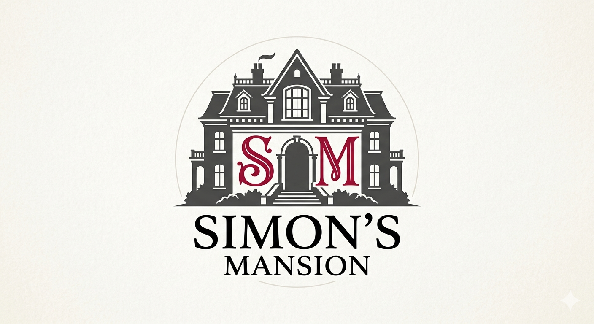
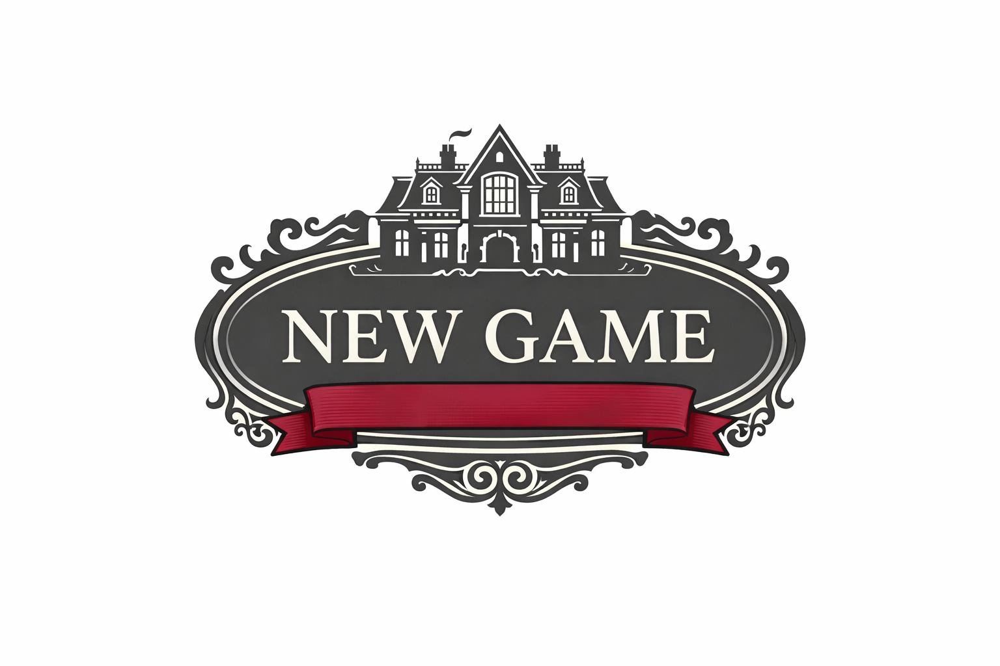
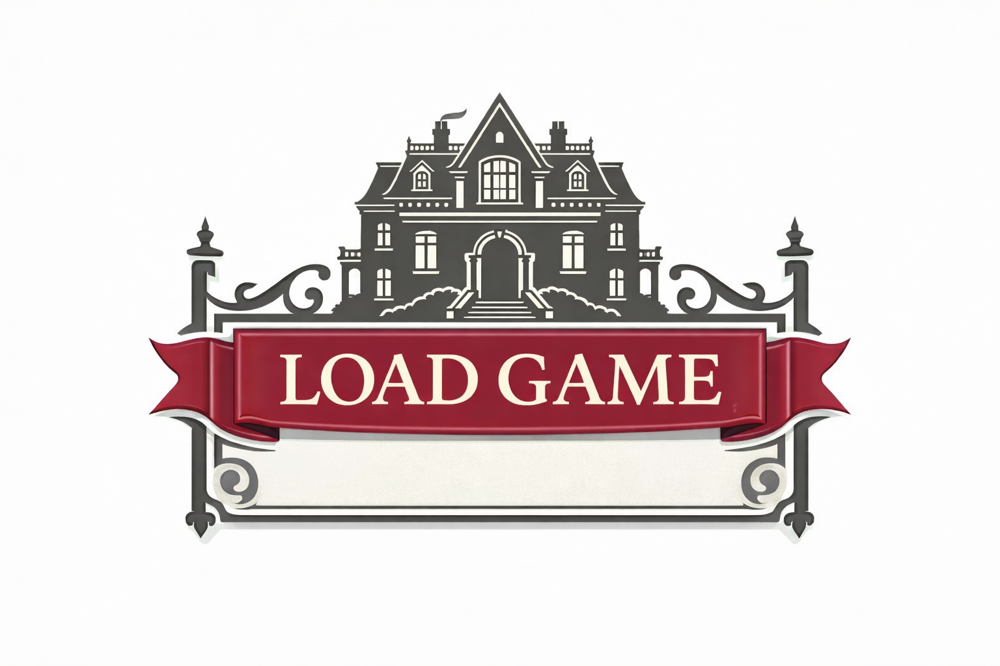
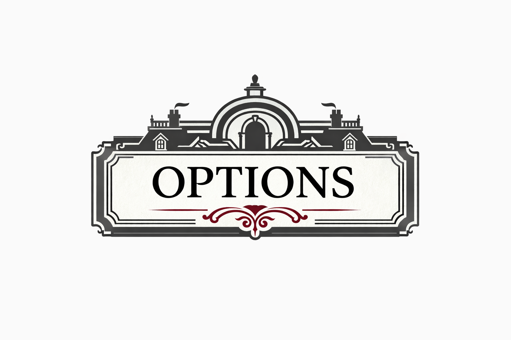
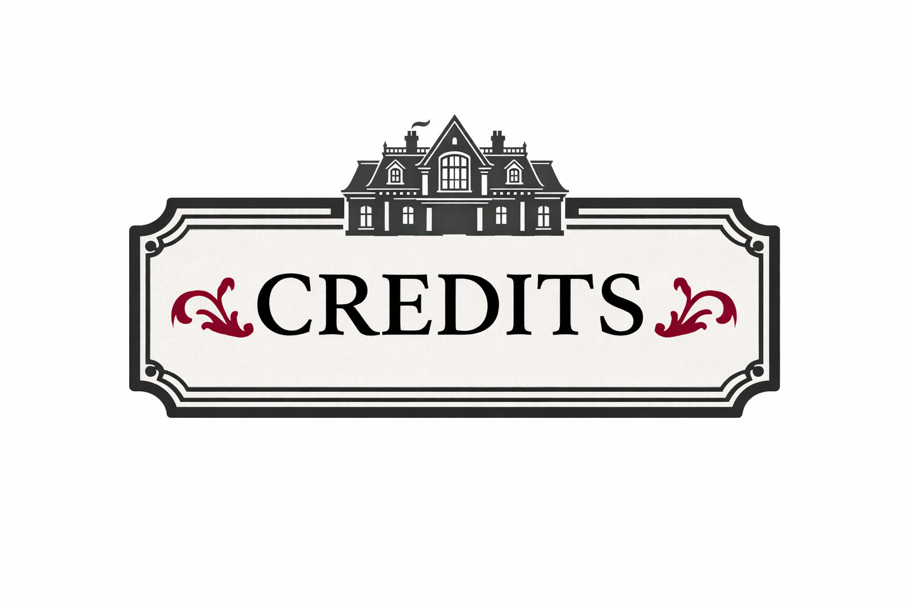
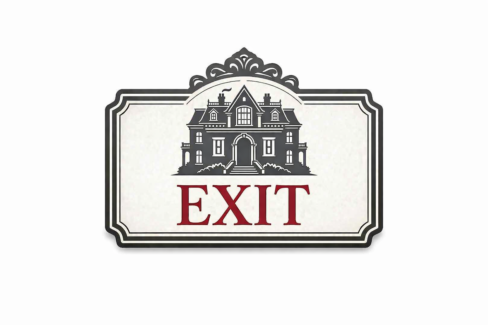

# Simon's Mansion

Proyecto en Unity para un juego narrativo de horror ambientado en la mansion de Simon. El trabajo actual esta centrado en dejar una base visual limpia para la pantalla de inicio mientras la historia y la estructura narrativa siguen referenciadas en `la_mansion_de_simon.py`.

  

## Estado actual

- Motor: Unity `6000.3.11f1`
- Render: URP con enfoque 2D
- UI: `uGUI` + `Input System`
- Escena de arranque: `Assets/Scenes/New Game.unity`
- Contenido actual jugable: menu principal visual listo para iterar

En este punto el proyecto ya arranca mostrando la escena `New Game` con fondo y botones visibles. Todavia no hay logica de navegacion ni gameplay implementado; el objetivo de este hito es consolidar la base visual y tecnica del inicio del juego.

## Menu actual

La escena inicial incluye:

- Fondo principal con la identidad visual de Simon's Mansion
- Botones inferiores en este orden: `New Game`, `Load Game`, `Options`, `Credits`, `Exit`
- `EventSystem` configurado para `Input System UI Input Module`
- `CanvasScaler` con resolucion base `1920x1080`

  
  
  
  
  

## Estructura relevante

- `Assets/Scenes/New Game.unity`: escena de inicio activa
- `Assets/Img/`: recursos visuales del menu actual
- `la_mansion_de_simon.py`: referencia narrativa base del universo, personajes y tono
- `Packages/manifest.json`: dependencias del proyecto

## Proximo foco

- Conectar funcionalidad real a los botones del menu
- Crear transicion desde `New Game` hacia la primera escena jugable
- Traducir el contexto narrativo de `la_mansion_de_simon.py` a escenas, objetos y sistemas dentro de Unity

## Como abrir y probar

1. Abrir el proyecto con Unity `6000.3.11f1`.
2. Abrir la escena `Assets/Scenes/New Game.unity` si no carga automaticamente.
3. Presionar Play para ver el menu principal actual.

## Nota del estado del proyecto

Este repositorio refleja una fase temprana del desarrollo. La prioridad actual es estabilizar la identidad visual, la estructura de escenas y la base tecnica del menu antes de integrar flujo de juego, audio interactivo y sistemas narrativos.